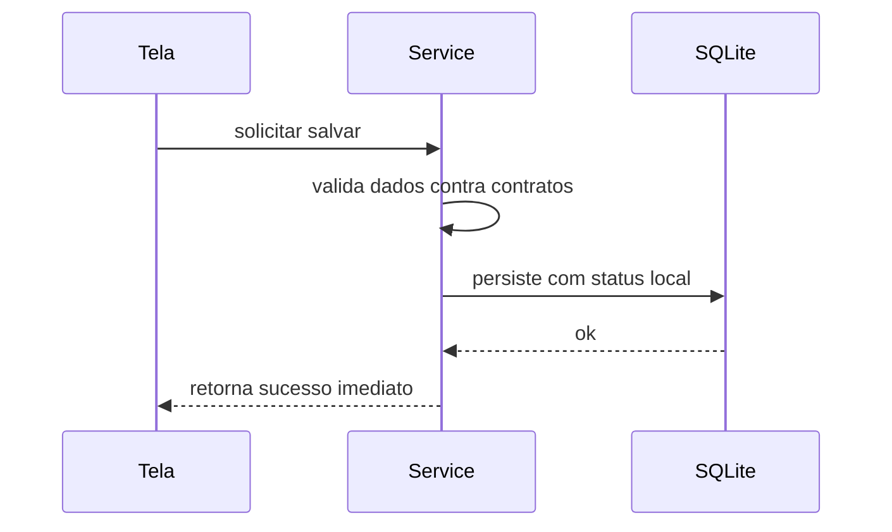

# Arquitetura e Estratégia Técnica – Mallow

## Objetivo
Prover uma base técnica simples, confiável e evolutiva para o app Mallow.  A estratégia apoia o **Spec‑Driven Development**: cada componente técnico deriva de uma especificação e de um contrato bem definido.  O foco do MVP é possibilitar o cálculo de preços offline e preparar terreno para sincronização futura.

## Stack e Decisões

### App Móvel
- **Expo + React Native**, com **TypeScript** como linguagem principal.
- Navegação com `@react-navigation` em modo stack para o fluxo de login e tab para a navegação principal.
- Persistência local com **SQLite** via Expo, incluindo migrações controladas.
- Estado local em componentes e uma camada de serviços para acesso ao banco, validação de contratos e aplicação das regras de negócio.
  - Integração com **Zod** para validar dados de entrada.  Cada contrato exporta um schema de validação (por exemplo, `quantidade_compra > 0`, `preco_compra > 0`, categorias válidas) que é executado pelos serviços antes de persistir ou atualizar dados.
- Autenticação via e‑mail/senha e social login (Google) usando bibliotecas do Expo.

### Backend (Futuro)
- Não há backend na primeira versão; todos os dados ficam no dispositivo.
- Versões futuras poderão usar **NestJS** ou **Next.js API** para prover sincronização e backup, mantendo TypeScript e compartilhando contratos.

## Serviços em Nuvem (Firebase)

Para enriquecer a análise de dados e preparar o aplicativo para funcionalidades futuras, o Mallow utilizará serviços do Firebase desde a primeira versão.

- **Firebase Installations**: Para identificar unicamente cada instalação do aplicativo, será utilizado o serviço `Firebase Installations`. A obtenção do `Installation ID` (`installations.getId()`) nos permitirá anonimizar a coleta de métricas de uso e entender melhor como o aplicativo se comporta em diferentes dispositivos, sem coletar dados pessoais. Este ID será fundamental para futuras implementações, como a sincronização de dados e o envio de notificações.

- **Analytics**: Eventos de negócio (ex: `produto_criado`, `insumo_cadastrado`) serão registrados no Firebase Analytics para monitorar o engajamento e a adoção de funcionalidades.

## Organização de Pastas

```
/src
  /specs          # Especificações funcionais (markdown)
  /contracts      # Tipos e interfaces TS compartilhados
  /modules
    /auth
    /insumos
    /produtos
    /custos
    /calculo
  /core
    /db           # Conexão SQLite e migrações
    /storage      # Abstrações de persistência
    /errors       # Manipulação de erros
    /metrics      # Eventos e tracking
    /config
  /ui
    /components
    /screens
    /theme
```

**Regras de organização**:

- Lógica de negócio nunca reside em telas.  Telas apenas chamam serviços que aplicam as regras definidas nos contratos.
- Para cada funcionalidade, escreve‑se primeiro a spec em `/specs` e o contrato correspondente em `/contracts`.
- Mudanças na estrutura das tabelas devem ser acompanhadas de scripts de migração versionados.

## Migrações de Banco

Para evoluir o esquema do SQLite de forma segura, mantenha uma tabela `schema_version` no banco.  Ao alterar a estrutura:

1. **Incrementar** o número da versão na tabela `schema_version`.
2. **Definir scripts de migração** (`upgrade`) e, quando viável, de reversão (`downgrade`) para adicionar ou modificar colunas sem perder dados.  Por exemplo, ao adicionar o campo `quantidade_por_embalagem` em insumos (versão 2):

    - Executar `ALTER TABLE insumo ADD COLUMN quantidade_por_embalagem REAL;`.
    - Ajustar registros existentes definindo `quantidade_por_embalagem = 1` onde estiver `NULL`, mantendo compatibilidade com V1.

3. **Aplicar automaticamente** as migrações pendentes na inicialização do app, garantindo que a estrutura local permaneça atualizada.

## Resolução de Conflitos

Quando a sincronização for implementada (versão 2), dois dispositivos podem alterar o mesmo registro offline.  A regra simples “última atualização prevalece” é suscetível a perda de dados.  Recomenda‑se:

- **Controlar versões**: adicione um campo de versão ou hash nos registros para detectar edições concorrentes.
- **Manter histórico**: registre alterações anteriores; em caso de conflito, apresente as versões para a usuária escolher ou mesclar.
- **Definir políticas por entidade**: algumas entidades podem tolerar merge automático (somar quantidades), enquanto outras exigem revisão manual.  Documente essas políticas para o backend.

Essas orientações não precisam ser implementadas no MVP, mas devem guiar o design da sincronização na versão 2.

## Offline‑First

- Todas as operações de cadastro, edição e cálculo devem funcionar sem internet.
- Cada registro possui um campo `sync_status` (`local`, `pending`, `synced`), permitindo saber o estado da sincronização.
- O app mantém a sessão localmente (SecureStore) e permite login automático offline após o primeiro acesso.
- A sincronização (v2) enviará registros com `sync_status` pendente para a API; conflitos serão resolvidos usando o campo `updated_at` (última atualização prevalece).

## Fluxo de Gravação



## Autenticação e Sessão

- A tela de login oferece e‑mail/senha ou Google.  Caso a usuária já tenha sessão local válida, é redirecionada para o app sem precisar de conexão.
- Sessões são armazenadas no SecureStore com validade de 30 dias, renovadas quando a usuária faz login novamente.
- O app pode ser usado em modo visitante (sem login) e depois migrar os dados quando a conta for criada.

## Segurança

- Credenciais de sessão são mantidas no **Expo SecureStore**.
- O banco SQLite não é criptografado no MVP; versões futuras podem adicionar criptografia.
- Senhas, quando enviadas ao backend, são armazenadas como hash; no app nunca são guardadas em texto.

## Atualizações e Evolução

- Publicação de correções e melhorias via **Expo EAS / Updates**.
- Manter scripts de migração compatíveis com versões antigas.
- Planejar o backend e o processo de sincronização com base nas necessidades futuras listadas na constituição do produto.