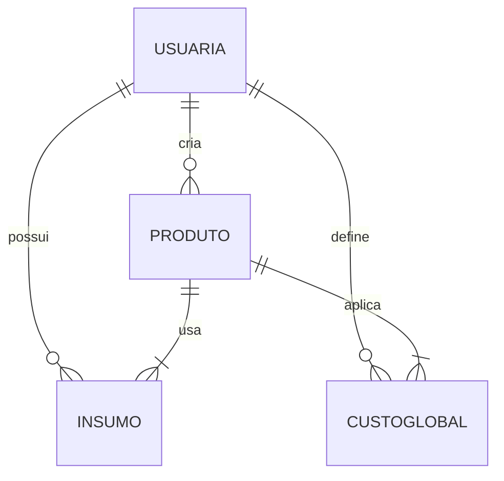

# Modelagem de Domínio e Entidades – Mallow

## Clarificações

### Session 2025-01-27

- Q: `quantidade_por_embalagem` é obrigatório quando? → A: Obrigatório quando `unidade_compra = 'caixa'` OU quando `unidade_compra = 'un'` e `quantidade_compra > 1`. Para outras unidades (kg, g, L, ml), é opcional.
- Q: Quando `quantidade_por_embalagem` não é informado (e não é obrigatório), o sistema deve assumir automaticamente 1 ou tratar de outra forma? → A: Assumir automaticamente `quantidade_por_embalagem = 1` quando não informado, simplificando o uso e mantendo a fórmula consistente.

## Entidades Principais

| Entidade        | Campos principais                                                                                                        | Observações                                                              |
|-----------------|---------------------------------------------------------------------------------------------------------------------------|--------------------------------------------------------------------------|
| **Usuária**     | `id`, `nome`, `email`, `senha_hash`, `created_at`                                                                         | Login via e‑mail/senha ou Google.                                        |
| **Insumo**      | `id`, `nome`, `categoria`, `unidade_compra`, `quantidade_compra`, `preco_compra`, `data_compra`, `quantidade_por_embalagem?`, `fornecedor?`, `observacoes?` | Convertido para a menor unidade (g/ml/unidade).  O campo `quantidade_por_embalagem` indica quantas unidades ou gramas há em cada embalagem (ex.: caixa de 12 unidades ou pacote de 500 g).  **Obrigatoriedade**: `quantidade_por_embalagem` é obrigatório quando `unidade_compra = 'caixa'` OU quando `unidade_compra = 'un'` e `quantidade_compra > 1`. Quando não informado (e não obrigatório), assume-se `quantidade_por_embalagem = 1`. As categorias são selecionadas de um enum fixo (`chocolate`, `farinha`, `açúcar`, `embalagem`, `decoração`, `outro`), evitando divergências de nomenclatura. |
| **CustoGlobal** | `id`, `nome`, `tipo`, `valor`, `ativo`                                                                                     | Custos fixos rateados proporcionalmente como overhead nos produtos. Campo `ativo` (boolean) indica se o custo está ativo e deve entrar no cálculo do overhead. |
| **Produto**     | `id`, `nome`, `rendimento`, `margem_lucro`, `insumos[]`, `custosExtras[]`, `preco_manual?`                                  | Lista de insumos com quantidades usadas e custos fixos selecionados.     |
| **Cálculo**     | `custo_total`, `preco_minimo`, `preco_sugerido`, `preco_unitario`, `margem_efetiva`                                        | Resultado derivado, não persistido em tabela, calculado em tempo real.   |

Cada tabela também inclui `user_id`, `created_at`, `updated_at` e `sync_status` para controle de sincronização e auditoria.

## Relacionamentos

## Regras de Negócio

- **Conversão de unidades**: cada insumo é convertido automaticamente para gramas, mililitros ou unidades.
- **Custo de insumo usado**: calcula‑se como `quantidade_usada * custo_por_unidade_base`, onde `custo_por_unidade_base = preco_compra / quantidade_base_total` e `quantidade_base_total` é a quantidade convertida para a unidade base (g/ml/un) conforme `docs/Logica-de-Negocio-e-Formulas.md` linhas 22-27.
- **Custo fixo (overhead)**: aplica‑se um percentual calculado a partir da soma dos custos fixos e de uma estimativa de faturamento mensal.
- **Cálculo de produto**: soma‑se o custo de insumos e o overhead, aplica‑se a margem de lucro e divide‑se pelo rendimento.
- **Margem efetiva**: se a usuária define um preço manual, calcula‑se a margem efetiva comparando com o custo total.
- **Validações básicas**: preços e quantidades não podem ser zero ou negativos; rendimento do produto deve ser maior que zero.
- **Sincronização**: os campos `sync_status` e `updated_at` permitem resolver conflitos quando a sincronização com backend estiver disponível.