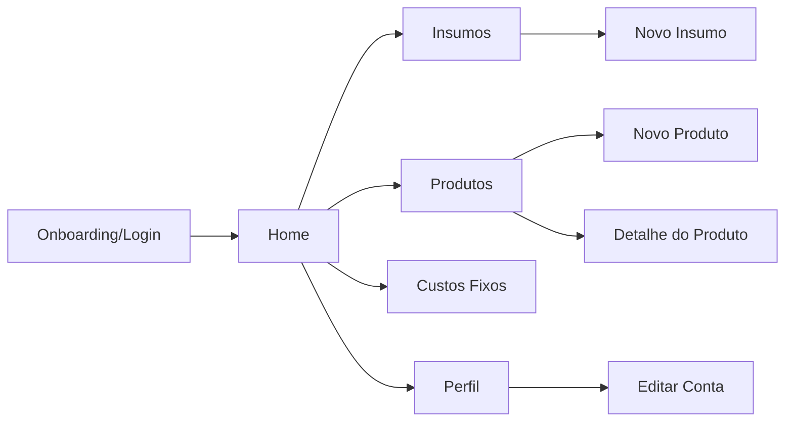
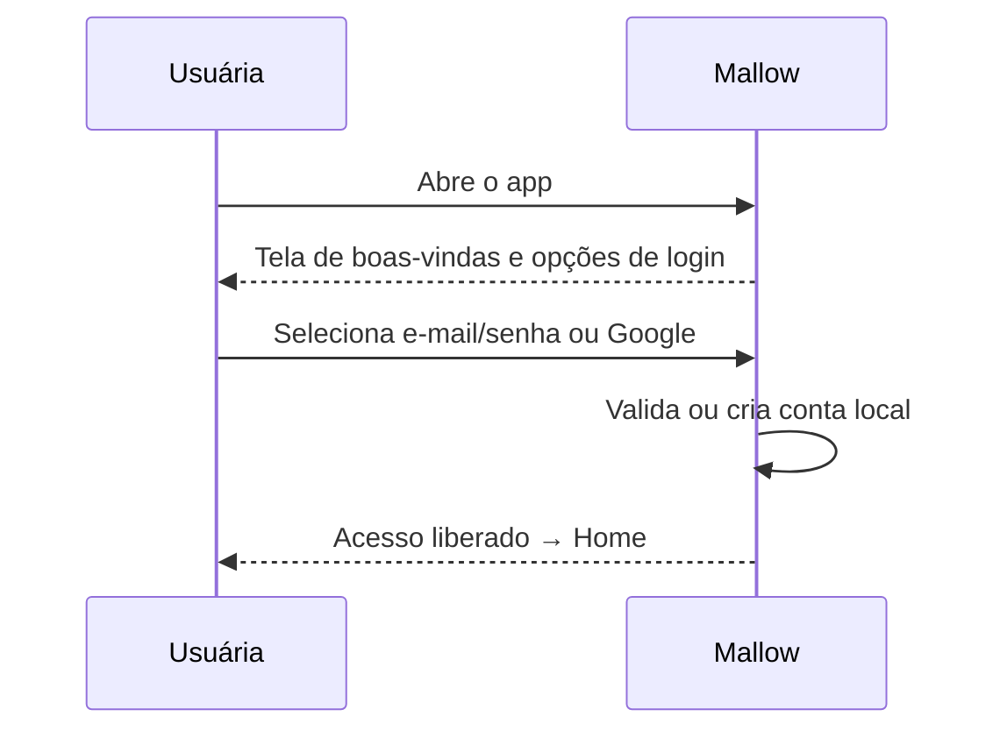
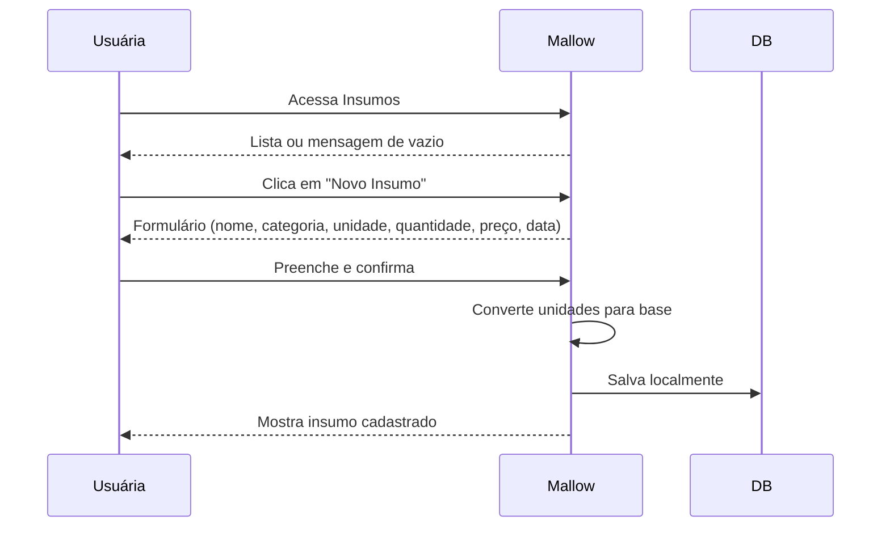
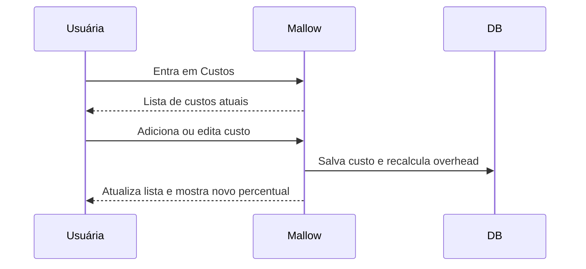
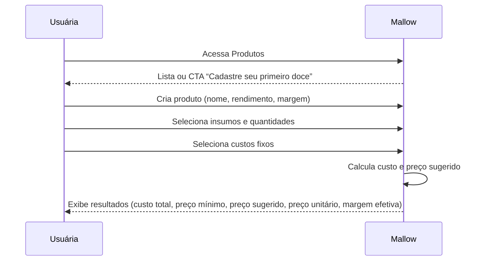

# Blueprint de Fluxos e UX – Mallow

## Estrutura de Navegação

| Seção                 | Propósito                                     | Tipo de Navegação |
|------------------------|-----------------------------------------------|-------------------|
| **Onboarding/Login**  | Entrada, cadastro e login social               | Stack             |
| **Home**              | Painel com métricas rápidas e atalhos          | Tab inferior      |
| **Insumos**           | Cadastro e gestão de insumos                   | Tab inferior      |
| **Produtos**          | Criação e cálculo de produtos                  | Tab inferior      |
| **Custos**            | Configuração de custos fixos                   | Tab inferior      |
| **Perfil**            | Conta e preferências da usuária                | Modal ou Tab      |

## Mapa de Navegação

## Jornadas Principais

### 1. Onboarding e Login

**Comportamento**: frases positivas, destaque para login Google, opção de modo visitante offline.

### 2. Cadastro de Insumo

**Regras UX**:
- Campos opcionais (fornecedor, observações) recolhidos por padrão.
- Mostrar custo unitário calculado após salvar.
- Mensagens de erro específicas para valores inválidos.

### 3. Configuração de Custos Fixos

### 4. Criação de Produto e Cálculo

**Exibição**:
- Valores de lucro em verde e prejuízo em vermelho.
- Botão “Explicar cálculo” abre tabela detalhada com insumos e custos.

### 5. Edição e Histórico

A usuária pode abrir produtos salvos, ajustar quantidades ou margens e ver o cálculo atualizado em tempo real.  Versões futuras poderão exibir histórico de revisões para cada produto.

## Estados Visuais

- **Vazio**: ícone do mascote Mallow e mensagem encorajadora (“Nada por aqui ainda 🍬”).
- **Erro**: balão vermelho discreto com texto específico (“Preço inválido”, “Campo obrigatório”).
- **Offline**: indicador discreto “Modo offline (dados locais)”.
- **Sucesso**: banner ou toast verde que desaparece após alguns segundos.

## Evolução de UX

| Versão | Novos recursos de UX                     |
|--------|------------------------------------------|
| **v2** | OCR para cadastrar insumos via foto; onboarding guiado por Mallow |
| **v3** | Relatórios comparativos; comunidade com feed de receitas |